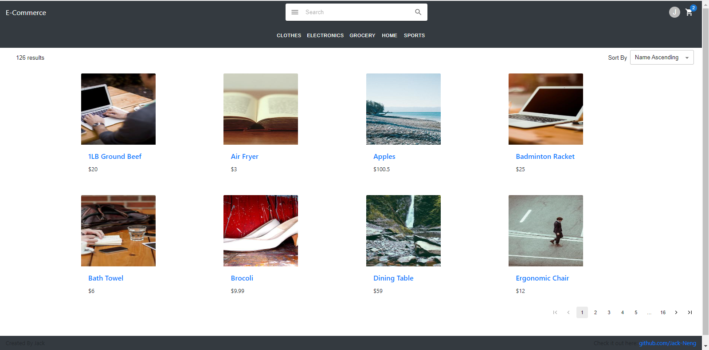
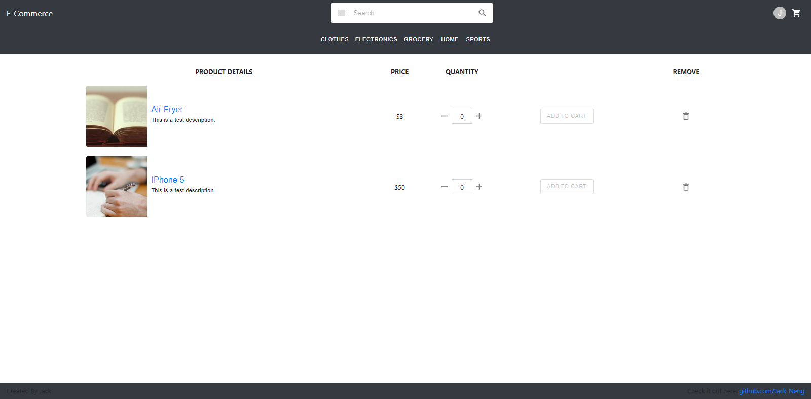
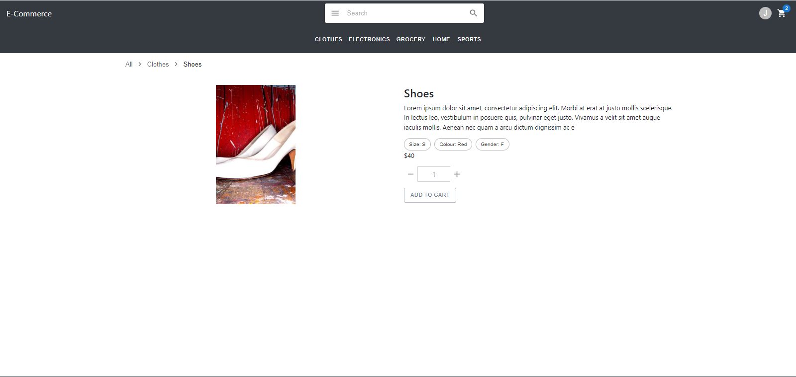
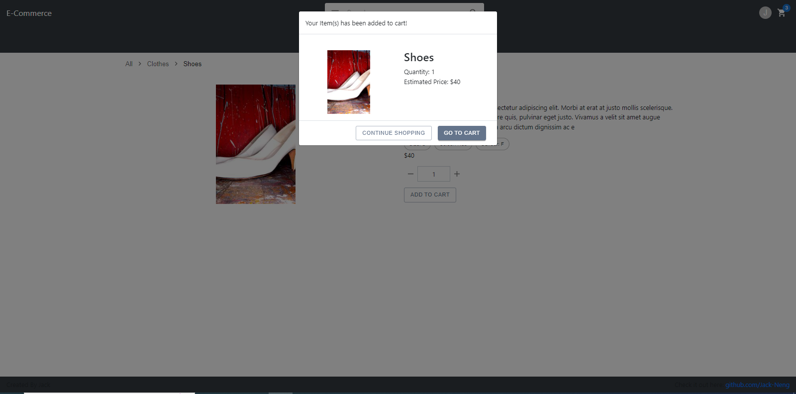
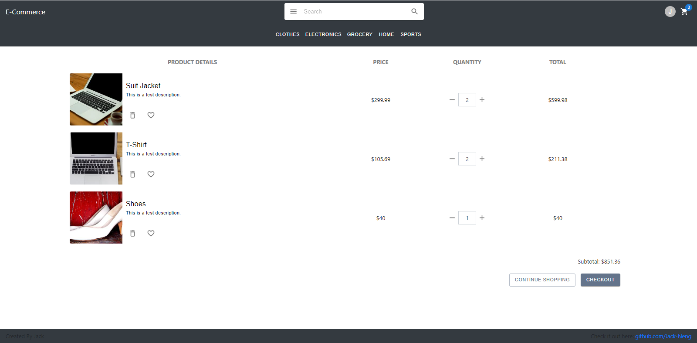
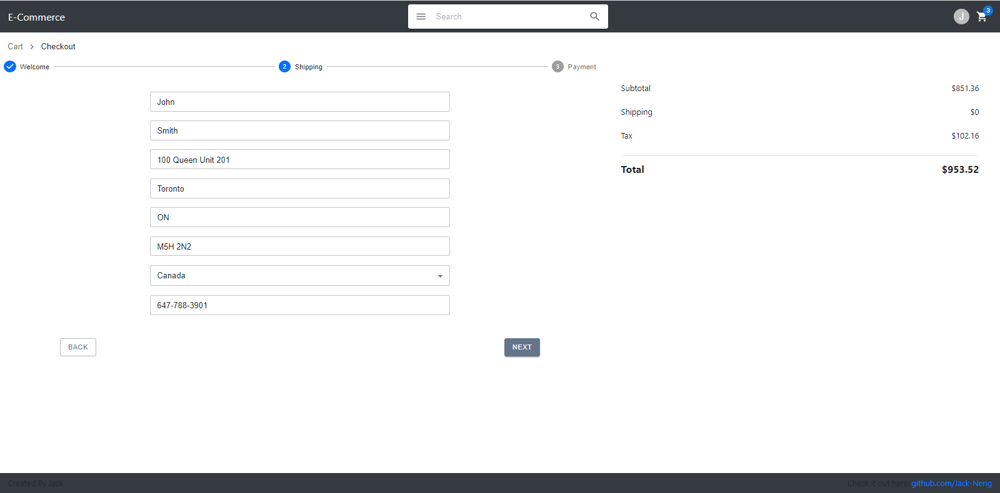
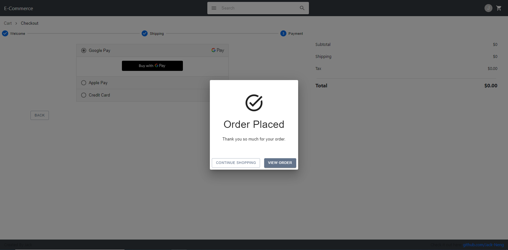
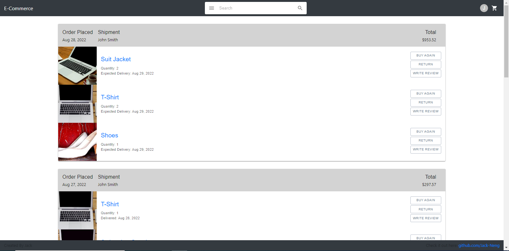

# E-Commerce

This project is a E-Commerce Site for people to do shopping online

## Technologies Used

JavaScript React.js is used to create the frontend app

Java Spring Boot is used to set up the backend server

MySql and AWS RDS is used to create a database

## Deployment

Client is deployed on Netlify.com

Server is deployed on Heroku.com

Database is deployed on AWS Rds

## Demo
Have a try on this link: https://competent-minsky-ccccf8.netlify.app/
Followings are some picture of the project

### Main Page To List All Products Being Sold On Site

### Create Your Favourite List

### Adding Item To Cart

### All Item In Cart

### Checkout Your Items

### Place Your Order

### Track Your Orders

